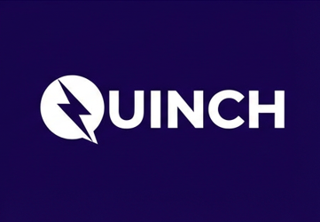

# QUINCH

> **Le réveil numérique du Sénégal.**
>
> Marketplace sociale sénégalaise pour découvrir, publier et mettre en relation des vendeurs, prestataires et utilisateurs autour de produits, services et contenus vidéo.



## 1. Vue d'ensemble

QUINCH est une application web composée de :

- **Angular 20** pour le frontend ;
- **Laravel 12 / PHP 8.2+** pour l'API ;
- **PostgreSQL 16** pour les données ;
- **Redis 7** pour cache, sessions, files d'attente et rate limiting ;
- **Nginx** pour servir l'API et les médias ;
- **Docker Compose** pour l'exécution ;
- **Caddy** pour la terminaison TLS en production ;
- **GitHub Actions** pour la CI ;
- **Object Storage + CDN** prévus pour la montée en charge des médias.

QUINCH est volontairement un **monolithe modulaire** : un backend Laravel bien séparé, un frontend Angular et des workers Docker. Il n'y a pas de microservices inutiles à maintenir au démarrage.

## 2. Fonctionnalités actuelles

### Utilisateurs et authentification

- inscription par e-mail + mot de passe ;
- connexion par e-mail + mot de passe ;
- récupération de mot de passe par code e-mail ;
- connexion Google ;
- téléphone facultatif dans le profil ;
- changement/suppression du compte ;
- sessions Sanctum avec expiration (8 h pour le staff, y compris via Google) ;
- changement d'e-mail protégé : mot de passe actuel exigé, alerte envoyée à l'ancienne adresse, autres sessions déconnectées ;
- changement de mot de passe : les autres appareils sont déconnectés ;
- pseudo unique sans tenir compte de la casse, noms réservés refusés (`admin`, `support`, tout nom contenant `quinch`…) ;
- blocage (dans les deux sens : messages, conversations, suivis, négociations) et signalement d'utilisateurs.

> **Décision actuelle :** le téléphone n'est pas obligatoire et le SMS OTP n'est pas utilisé pour le parcours normal d'authentification. Les anciennes références à un OTP SMS obligatoire sont obsolètes.

### Marketplace sociale

- publication de produits/services ;
- photos et vidéos ;
- feed vidéo ;
- marketplace ;
- recherche et suggestions ;
- profils publics ;
- vendeurs actifs ;
- likes, sauvegardes et favoris ;
- collections de favoris ;
- partage ;
- avis (réservés aux acheteurs d'une transaction finalisée ou aux personnes ayant échangé avec le vendeur) ;
- abonnements/follow ;
- classements ;
- badges ;
- négociation lorsque la fonctionnalité est activée.

### Messagerie

- conversations entre utilisateurs ;
- messages ;
- badges de messages non lus ;
- présence/dernière activité ;
- rattachement d'un produit à une conversation ;
- audio/fichiers selon les feature flags actuels (les métadonnées d'un message sont toujours construites par le serveur, jamais fournies par le client).

### Administration

Le panneau d'administration comprend notamment :

- tableau de bord ;
- utilisateurs ;
- équipe/staff ;
- sécurité ;
- produits ;
- catégories ;
- modération ;
- signalements ;
- transactions ;
- Premium ;
- avis ;
- notifications ;
- badges ;
- inbox/support ;
- paramètres.

Les actions sensibles sont protégées par rôles et permissions côté backend.

### Premium et paiements

QUINCH monétise l'accès à sa version Premium. **QUINCH ne gère pas les transactions commerciales entre utilisateurs.**

Le backend contient l'architecture des passerelles de paiement, notamment :

- Wave ;
- Orange Money ;
- cash pour certains flux internes/testés.

La production doit utiliser de vraies credentials marchand et les webhooks vérifiés. Il n'existe plus de simulateur de paiement en production.

Les webhooks de commande (Wave et Orange Money) passent par `App\Services\Payments\OrderPaymentConfirmer` : verrou de ligne, idempotence, montant et devise vérifiés, un échec n'annule jamais une commande payée (voir `docs/PAYMENTS.md`).

### Mode bêta

Avec `QUINCH_BETA=true`, la publication avec vidéo est gratuite et les paiements Premium sont désactivés (message « Le mode de
paiement n'est pas actif actuellement pour la version bêta »). Les premiers utilisateurs peuvent **postuler au Premium offert**
(100 places, 90 jours par défaut) depuis la page Premium ; l'équipe est notifiée et décide dans **Équipe & Premium**. Une adresse
e-mail confirmée est exigée. Détails, comptes de l'équipe et liste de contrôle : [`docs/BETA.md`](docs/BETA.md).

## 3. Architecture

```text
                         INTERNET
                            │
                     Cloudflare / DNS
                            │
                     Caddy / HTTPS
                            │
             ┌──────────────┴──────────────┐
             │                             │
       Angular / Nginx              API Nginx
             │                             │
             │                         Laravel
             │                       /    │    \
             │                 PostgreSQL Redis  Queue
             │                                  │
             │                              FFmpeg/video
             │
             └────────────── QUINCH ──────────────

Production média cible :
Laravel → Object Storage → CDN → utilisateurs
```

### Services Docker

| Service | Rôle |
|---|---|
| `postgres` | PostgreSQL 16 |
| `redis` | cache, sessions, queues, rate limiting |
| `app` | Laravel/PHP-FPM |
| `queue` | jobs applicatifs |
| `queue_videos` | traitement vidéo/FFmpeg |
| `scheduler` | tâches Laravel planifiées |
| `nginx` | reverse proxy/API et fichiers médias |
| `web` | frontend Angular en production |
| `caddy` | HTTPS automatique en production |
| `pgadmin` | outil local optionnel |

## 4. Arborescence

```text
QUINCH/
├── backend/                 # API Laravel
│   ├── app/
│   ├── config/
│   ├── database/
│   ├── routes/
│   ├── tests/
│   └── docker/
├── frontend/                # Angular
│   ├── src/
│   └── public/
├── docs/                    # Documentation projet
├── docker-compose.yml       # environnement Docker de base
├── docker-compose.prod.yml  # surcouche HTTPS/frontend production
├── .env.example             # variables Compose sans secrets
└── README.md
```

## 5. Démarrage local

### Prérequis

- Docker Desktop ou Docker Engine + Compose v2 ;
- Git ;
- Node.js 22+ si développement Angular hors Docker ;
- PHP 8.2+ et Composer 2 si développement Laravel hors Docker.

### Option Docker

```bash
git clone <URL_DU_DEPOT>
cd QUINCH

cp .env.example .env
cp backend/.env.docker.example backend/.env.docker
```

Remplacer les valeurs `CHANGE_ME` et renseigner les variables nécessaires au scénario local.

Puis :

```bash
docker compose build
docker compose up -d
```

API locale : `http://localhost:8080`

PostgreSQL : `127.0.0.1:5432`

pgAdmin optionnel :

```bash
docker compose --profile tools up -d pgadmin
```

Puis ouvrir `http://127.0.0.1:5050`.

### Frontend hors Docker

```bash
cd frontend
npm ci
npm start
```

L'application de développement Angular est disponible sur `http://localhost:4200`.

### Développer avec le backend Docker

`npm start` utilise `proxy.conf.json` (API sur `127.0.0.1:8000`, c'est-à-dire `php artisan serve`). Pour travailler contre les
conteneurs (Redis, workers, stockage partagé), utiliser :

```bash
cd frontend
ng serve --proxy-config proxy.docker.conf.json   # API sur 127.0.0.1:8080
```

Le code est copié dans les images : après un changement backend, reconstruire avec
`docker compose up -d --build app queue queue_videos scheduler` puis `docker compose exec app php artisan migrate --force`.
Avec Docker, `QUEUE_CONNECTION=redis` est obligatoire (sinon notifications à tous et e-mails restent en attente).

## 6. Configuration production

Ne jamais committer les vrais fichiers `.env`.

Créer :

```bash
cp .env.example .env
cp backend/.env.docker.example backend/.env.docker
```

Les secrets doivent être injectés sur le serveur :

- `APP_KEY` ;
- mot de passe PostgreSQL ;
- mot de passe Redis ;
- credentials SMTP/e-mail ;
- credentials Wave ;
- credentials Orange Money ;
- credentials Google OAuth ;
- secrets de webhook.

### Préflight

Avant de démarrer en production :

```bash
docker compose exec app php artisan quinch:preflight
```

Le préflight doit refuser notamment :

- `APP_DEBUG=true` ;
- CORS localhost en production ;
- queue synchrone ;
- Redis sans authentification lorsque requis ;
- secrets Wave manquants lorsque Wave est activé ;
- configuration de récupération e-mail non fonctionnelle ;
- autres paramètres explicitement dangereux.

## 7. HTTPS / production

La surcouche de production :

```bash
docker compose \
  -f docker-compose.yml \
  -f docker-compose.prod.yml \
  up -d --build
```

Variables racine nécessaires :

```text
API_DOMAIN=api.quinch.sn
APP_DOMAIN=quinch.sn
ACME_EMAIL=contact@quinch.sn
```

Caddy obtient et renouvelle les certificats Let's Encrypt. Nginx reste derrière Caddy.

## 8. E-mail et récupération de compte

Le parcours officiel est :

```text
Utilisateur
   ↓
Mot de passe oublié
   ↓
Adresse e-mail
   ↓
Code temporaire
   ↓
Vérification
   ↓
Nouveau mot de passe
```

Le code doit être :

- temporaire ;
- limité en tentatives ;
- limité en fréquence ;
- invalidé après utilisation ;
- non exposé dans les réponses publiques ;
- envoyé par un vrai fournisseur transactionnel en production.

Voir `docs/EMAIL.md`.

## 9. Paiements

Le Premium est le seul paiement géré directement par QUINCH.

### Flux recommandé

```text
Angular
   ↓
Laravel
   ↓
Wave / Orange Money
   ↓
Webhook signé
   ↓
Vérification + idempotence
   ↓
Transaction DB
   ↓
Activation Premium
```

Le frontend ne doit jamais décider seul qu'un paiement est réussi.

Voir `docs/PAYMENTS.md`.

## 10. Sécurité

Les protections déjà intégrées comprennent notamment :

- Sanctum ;
- rate limiting sur les routes sensibles ;
- middleware de rôles/permissions ;
- préflight production ;
- headers de sécurité ;
- CORS explicite ;
- cookies HTTP-only/secure lorsque utilisés ;
- expiration des tokens ;
- validation des données ;
- contrôle d'accès côté backend ;
- audit des actions administratives ;
- aucune erreur 500 sur entrée invalide : identifiants non-UUID en 404, valeurs trop longues en 422, gestionnaire global des erreurs PostgreSQL ;
- annonces non publiées, profils bannis ou supprimés et chiffre d'affaires des vendeurs non exposés publiquement ;
- compteurs de vues dédupliqués, transitions de commande atomiques, `ffmpeg` limité aux protocoles `file`/`https` ;
- détection/modération ;
- Gitleaks dans la CI ;
- audit Composer/npm ;
- CSP prévue/activable par environnement.

Voir `docs/SECURITY.md`.

### Comptes de l'équipe

- Le rôle `super_admin` s'attribue uniquement par `php artisan quinch:set-role <email> super_admin` sur le serveur.
- Mot de passe de l'équipe : 14 caractères minimum au changement, 12 minimum à la création ou réinitialisation.
- Pseudos contenant `quinch` réservés ; le compte officiel reçoit son pseudo par le serveur.
- `DatabaseSeeder` (compte `admin@quinch.sn`) est réservé à `local` et `testing` : ne jamais l'exécuter sur un serveur.
- Pas encore de double authentification (2FA) applicative : à prévoir avant une ouverture large. Voir `docs/SECURITY.md`.

## 11. CI/CD

GitHub Actions exécute actuellement :

1. installation Composer ;
2. `composer audit` ;
3. tests PHPUnit ;
4. `npm ci` ;
5. `npm audit` production ;
6. build Angular ;
7. validation Docker Compose ;
8. build des images Docker ;
9. scan Gitleaks.

Dependabot surveille Composer, npm, Docker et GitHub Actions.

## 12. Tests

Backend :

```bash
cd backend
php artisan test
```

Frontend :

```bash
cd frontend
npm test
```

Environ 420 tests backend (PHPUnit sur PostgreSQL) couvrent notamment l'authentification, l'OTP e-mail, la protection contre la prise de compte, les permissions admin, la modération, les favoris, les follows, les badges, les paiements Wave/Orange Money et leurs webhooks, la réconciliation, Premium, la machine d'état des commandes, l'absence d'erreur 500 sur entrées invalides, l'exposition publique des données, les limites de pagination et plusieurs scénarios de sécurité.

Il n'existe pas de test unitaire Angular (`npm test` exécute 0 test) : l'interface se vérifie par `ng build --configuration production`
et un parcours manuel (voir `docs/BETA.md`). Contrôles complémentaires : `composer audit`, `npm audit --omit=dev --audit-level=high`,
`php artisan quinch:preflight --as=production`, `docker compose exec app php artisan quinch:health --deep`.

Après une mise à jour du code : `docker compose exec app php artisan migrate --force` (la table `blocked_users` et ses clés étrangères sont créées par migration).

## 13. Médias et vidéos

Le stockage local Docker est acceptable pour le développement et une petite bêta.

Pour la production durable, la cible est :

```text
Upload
  ↓
Laravel
  ↓
Object Storage
  ↓
Traitement vidéo asynchrone
  ↓
Thumbnail / vidéo prête
  ↓
CDN
```

Il faut éviter de faire du VPS le stockage définitif de toutes les vidéos.

## 14. Exploitation

Avant l'ouverture publique :

- sauvegardes PostgreSQL (`scripts/backup/backup.sh`, `docs/BACKUPS.md`) ;
- test de restauration (`scripts/backup/restore-test.sh`) ;
- monitoring (`GET /api/v1/ops/health`, Uptime Kuma, `docs/MONITORING.md`) ;
- alertes disque/RAM/CPU ;
- surveillance des queues ;
- préproduction (`docs/STAGING.md`, `scripts/staging-smoke-test.sh`) ;
- tests de charge k6 (`load-tests/`, `docs/LOAD-TESTING.md`) ;
- stockage objet/CDN (`MEDIA_DRIVER=s3`, `docs/STORAGE.md`) ;
- procédure de rollback.

Inventaire de tous les services, de leur rôle et des conséquences d'une panne : `docs/SERVICES.md`.
Voir aussi `docs/OPERATIONS.md`.

## 15. Conformité

Mis en place (phase 5) :

- pages publiques `/legal/cgu`, `/legal/confidentialite`, `/legal/mentions-legales` ;
- informations de l'éditeur réglées par les variables `LEGAL_*` (la production refuse de démarrer si elles manquent) ;
- consentement mémorisé (date + version) ; la connexion Google reste verrouillée tant que la case
  d'acceptation des conditions n'est pas cochée, et le serveur refuse (422 `terms_required`) de créer un compte
  sans cette acceptation ;
- export complet des données (`GET /users/export-data`) et suppression de compte avec effacement différé
  des contenus (30 jours) ;
- registre des traitements pour la déclaration à la CDP.

Reste avant l'ouverture publique : constituer l'entité, déclaration CDP, relecture par un juriste.

Voir `docs/LEGAL.md` et `docs/conformite/`.

## 16. Variables métier principales

| Variable | Exemple | Usage |
|---|---:|---|
| `QUINCH_PREMIUM_PRICE_MONTHLY` | `2000` | Premium mensuel en XOF |
| `QUINCH_PREMIUM_PRICE_ANNUAL` | `20000` | Premium annuel en XOF |
| `QUINCH_LISTING_FEE_WITH_VIDEO` | `150` | frais de publication avec vidéo (affiché 0 en bêta) |
| `QUINCH_BETA` | `true` | mode bêta : publication vidéo gratuite, paiements Premium coupés |
| `QUINCH_PREMIUM_PAYMENTS` | `false` | paiements Premium (sans effet si `QUINCH_BETA=true`) |
| `QUINCH_PREMIUM_OFFER_SLOTS` | `100` | places du Premium offert |
| `QUINCH_PREMIUM_OFFER_DAYS` | `90` | durée du Premium offert, en jours |
| `QUINCH_FEATURE_NEGOTIATION` | `true` | négociation |
| `QUINCH_FEATURE_FOLLOW` | `true` | abonnements |
| `QUINCH_FEATURE_REVIEWS` | `true` | avis |
| `QUINCH_FEATURE_BADGES` | `true` | badges |
| `QUINCH_FEATURE_SHARING` | `true` | partage |
| `QUINCH_FEATURE_CHAT_AUDIO` | `true` | audio dans le chat |
| `QUINCH_FEATURE_CHAT_FILE` | `true` | fichiers dans le chat |
| `QUINCH_FEATURE_PURCHASES` | `false` | achats entre utilisateurs désactivés |
| `LEGAL_PUBLISHER_NAME` / `LEGAL_PUBLISHER_ADDRESS` | `…` | éditeur affiché dans les mentions légales (obligatoire en production) |
| `LEGAL_CONTACT_EMAIL` | `contact@quinch.sn` | contact légal et exercice des droits |
| `LEGAL_HOST_NAME` / `LEGAL_HOST_LOCATION` | `Contabo GmbH` / pays | hébergeur et pays des serveurs |
| `MEDIA_DRIVER` | `local` | `local` (disque) ou `s3` (stockage objet, voir `docs/STORAGE.md`) |
| `MEDIA_CDN_URL` | vide | URL publique des médias servie par le CDN (https) |
| `HEALTH_TOKEN` | vide | jeton de `GET /api/v1/ops/health` (vide = désactivé) |
| `DB_EMULATE_PREPARES` | `false` | `true` uniquement derrière PgBouncer |
| `QUINCH_ALLOW_LOADTEST_DATA` | `false` | `true` en préproduction seulement (comptes de test k6) |
| `LEGAL_ANONYMIZED_CONTENT_DAYS` | `30` | délai avant effacement définitif des contenus d'un compte supprimé |

## 17. Décisions d'architecture à conserver

- Ne pas transformer QUINCH en microservices prématurément.
- Ne pas remplacer Laravel par Spring Boot sans problème concret à résoudre.
- Ne pas exposer PostgreSQL ou Redis à Internet.
- Ne jamais placer une clé Wave dans Angular.
- Ne jamais considérer une redirection frontend comme preuve de paiement.
- Ne pas stocker durablement toutes les vidéos sur le disque du VPS.
- Ne pas rendre le téléphone obligatoire si le produit n'en a pas besoin.
- Garder la validation et l'autorisation côté Laravel, même si Angular possède des guards.

## 18. Licence / propriété

Projet QUINCH. Les éléments de marque, contenus, logos et règles métier restent sous le contrôle du propriétaire du projet. Adapter cette section avec les mentions juridiques définitives avant publication publique.

---

**Dernière révision : 9 octobre 2026** (audit de sécurité traité : voir `docs/CHANGELOG-2026-10.md` et `docs/SECURITY.md`)
